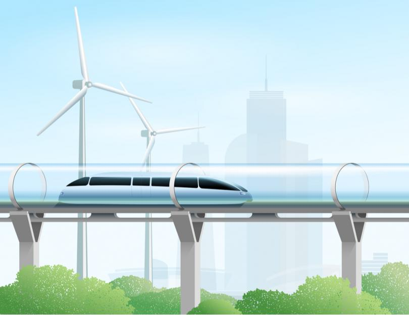

Requirement #5: Technology @ life
+++++++++++++++++++++++++++++++++

:math:`\boxed{\mathbb{REQ}\Large \rightsquigarrow}` Discuss with your counselor how technology affects your everyday life.

.. admonition:: Additional Challenge

   You have certainly heard about the self-driving car developped by a number of technology companies. With the help of your counselor or a guardian, perform research on the topic. Consider both the software and hardware challenges associated with the development of self-driving cars. Find out more about safety as well.  
   

   An artist's view of a future electric train powered by renewable energy. (Image obtained from https://builtin.com/transportation-tech). Check out the website for many other cool examples of modern transport technologies!

    	       
   
.. attention:: Once you have completed this requirement, make sure you document it in your worksheet!

